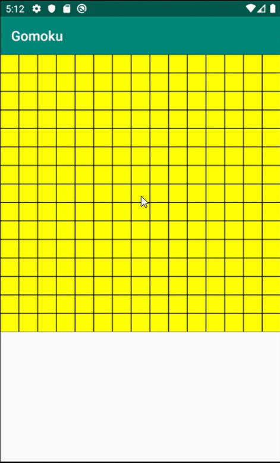

A mobile application that simulates the Gomoku game, an advance version of tic-tac-toe on a 15x15 board. Winner is the one who first get 5 stones in a row, horizontally, vertically, or diagonally.

The project uses Minimax algorithm with Alpha-Beta pruning for the AI (Artificial Intelligence).

Currently the project is only for 1 player.

Future works:
  + Add an option to choose player vs player
  + Make more levels (easy-medium-hard)
  + Add more GUI to let users choose who will go first, and let them choose the color of their stones
 
DEMO:

